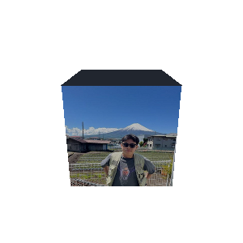

<h1 align="center"><samp>Tan Jian Ron</samp></h1>

  

<samp>Computer Science @ NUS · SRE intern @ CPF Board · Singapore</samp>

  
  
  
  

## <samp>About</samp>

<samp>I'm Ron, a Computer Science undergraduate at NUS. Currently an SRE intern at the Central Provident Fund Board, working on Terraform, AKS, and Azure DevOps pipelines for systems serving 4M+ CPF members. Also Vice-Chair of NUS Sheares Web, where I lead 16 developers shipping a hall intranet and React Native app used by 400+ residents.</samp>

## <samp>Projects</samp>

### <samp>♠️ AllIn: heads-up poker AI</samp>

<samp>A poker bot you can actually play, live at **[allin.jianrontan.com](https://allin.jianrontan.com)**.</samp>

- <samp>Trained a **200K info-set CFR blueprint over 50M self-play iterations** for heads-up play.</samp>
- <samp>On high-stakes river decisions it doesn't just read the blueprint: a **safe, blueprint-anchored solver runs CFR live** to approximate game-theory-optimal play in real time.</samp>
- <samp>Productionised end to end: Flask/gunicorn API on **AWS Lightsail** behind **Cloudflare**, with DynamoDB, ECR, and SQLite.</samp>
- <samp>CI/CD via **GitHub Actions with OIDC** (no long-lived AWS keys) and multi-stage Docker builds tested against a prod-equivalent image.</samp>

### <samp>♟️ Chess explanation engine</samp>

<samp>Engines tell you the best move; they can't tell you *why*. This is a **RAG pipeline that grounds LLM chess explanations in Stockfish analysis and retrieved human commentaries**, so the explanation matches what the engine actually sees. Live at **[chess.jianrontan.com](https://chess.jianrontan.com)**.</samp>

## <samp>Stack</samp>

**<samp>Languages</samp>**

  
  
  
  
  

**<samp>Infrastructure</samp>**

  
  
  
  
  
  
  
  

**<samp>Web & data</samp>**

  
  
  
  
  
  
  
  
  

<samp>Where I've used all this</samp>

 

- <samp>**CPF Board**: Azure GCC infra and CI/CD: Terraform provisioning, AKS, Azure DevOps pipeline templates across non-prod and prod.</samp>
- <samp>**NUS Sheares Web**: GitHub Actions CI/CD with Liquibase schema migrations and a plan/apply data pipeline on Postgres; AWS infra with SST (CloudFront, Lambda SSR, S3), isolated preprod/prod on Supabase.</samp>
- <samp>**Screening Eagle | Proceq**: Cross-platform E2E test framework (Playwright + TypeScript, 10+ device/browser configs on BrowserStack, GitLab CI); 100+ regression cases automated with Python and AltTester.</samp>
- <samp>**TES Capital**: AI document automation (ChatGPT API, n8n, React, Flask): OCR + prompt workflows turning unstructured insurance data into standardised policy documents at 95% accuracy.</samp>
- <samp>**Hysses**: Full-stack ops platform (React, Node.js, Express, MySQL, Docker) with a custom NetSuite↔MySQL integration API.</samp>

<!-- Stats hidden until the public github-readme-stats instance is reliable (or self-hosted)

## <samp>Stats</samp>

  <picture>
    <source media="(prefers-color-scheme: dark)" srcset="https://github-readme-stats.vercel.app/api?username=jianrontan&show_icons=true&theme=tokyonight&hide_border=true">
    <source media="(prefers-color-scheme: light)" srcset="https://github-readme-stats.vercel.app/api?username=jianrontan&show_icons=true&theme=default&hide_border=true">
    
  </picture>
  <picture>
    <source media="(prefers-color-scheme: dark)" srcset="https://github-readme-stats.vercel.app/api/top-langs/?username=jianrontan&layout=compact&theme=tokyonight&hide_border=true&hide=html,css,jupyter%20notebook">
    <source media="(prefers-color-scheme: light)" srcset="https://github-readme-stats.vercel.app/api/top-langs/?username=jianrontan&layout=compact&theme=default&hide_border=true&hide=html,css,jupyter%20notebook">
    
  </picture>

-->

---

<samp> Computer Science @ NUS ·  <a href="mailto:jianrontan101@gmail.com">jianrontan101@gmail.com</a></samp>

